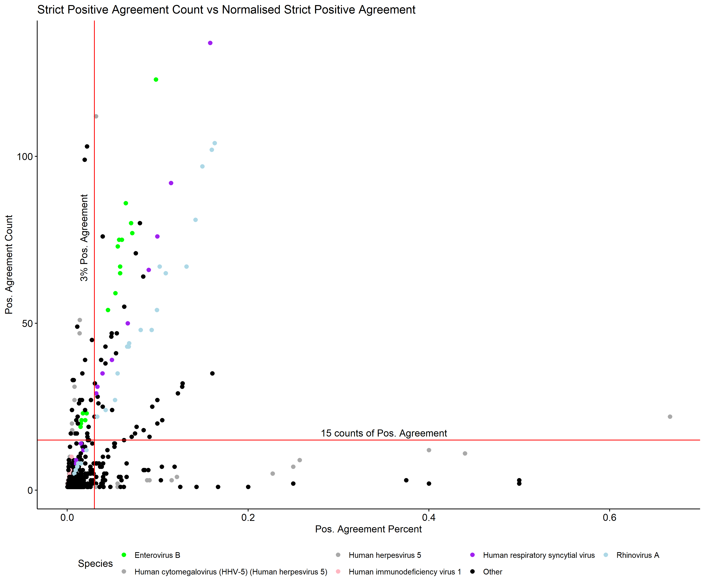

# WookFlow Analyser (A post-WookFlow reporting tool)
----
## Introduction

Phippery generates a bunch of useful outputs (such as hits and counts data) that are usually difficult to digest and/or interpret. After applying methods such as edgeR to help distinguish real hits from noise using beads-only background samples, it is often the case that we don't really understand what the hits are hinting at. This leads to wavering confidence in what sort of viruses or peptides of viruses (in the case of VirScan) to take forward for downstream analysis.

Some questions surrounding PhIPSeq and Phippery that render interpretation of the outputs difficult include:

1) How many peptide hits is sufficient to call a species to be identified by PhIPSeq?
2) In the case of VirScan, there are different number of peptides representing a viral species. Can a hit in this case be treated equally for viral species that have vastly different number of representative peptides?
3) Some viruses that were detected with hit peptides were not expected. If we accept the results some viral species, we must also accept these strange viral species too. How do we move forward?

The **aim** of this tool is to assist by automatically identifying potential peptides and viral species (based on the peptides) then group them into high priority (likely found) and lower priority (probably a technical artifact from the method). This way we create a streamlined and automated approach to process data prior to downstream statistical analyses or any other experimental procedures. While Phippery does output information of peptides and viral species, they are not compiled and summarised in an easy to digest way. Hence this tool also provides more detailed information for the peptides so that even without data science tools, readers can have a general idea about the samples they've used and what Phippery can tell them.

The tool uses basic R libraries (e.g. `optparse` and `scales`) which should already be included in any R and RStudio installation. You may need to install `tidyverse` if you don't have it. As this tool continues to update, we will create an environment in `docker` so it will always run within it's happy environment. This is a future-me to-do though.
```
install.packages("tidyverse")
```
***NOTE**: Current tool focuses on VirScan. HuScan to be implemented over time. Only Strict filtering has been implemented for now.*

## More detailed explanation

WookFlow Analyser assumes that replicates were used during PhIPSeq runs (E.g. for VirScan our team usually performs **triplicates**, a choice that balances cost and results). Using the replicates, the tool decides whether edgeR results from Phippery are consistently called. It does this by considering agreements between replicates given the same sample. We define an agreement as:

- Strict filtering:
  1.  (YES/YES/YES & NO/NO/NO) is considered an agreement, while disagreement looks like (YES/NO/either)
  2.  Within agreement, we can categorise Y/Y/Y as **strict positive agreement** and N/N/N as **strict negative agreement**.
  3.  In the strict case we treat Y/Y/N and Y/N/N as general disagreement.

In Strict Filtering, we will consider the normalisation of the **strict positive agreement** counts by dividing it with total agreements (Y/Y/Y and N/N/N) and call this the **agreement percent**. This helps us examine the condition where given all the ways which replicates can agree (negatively or positively), what proportion can fall under the category *“Yes all replicates positively agree to have found this peptide as a hit”*. Especially when we know that each species have a different number of representative peptides. E.g. enterovirus A have approxiately 1500 while HIV would have 2500. 

The question is, if observing 15 **strict positive agreement** peptides for enterovirus A have the same weighting as observing 15 **strict positive agreement** for HIV knowing that there are more opportunities for HIV available?

WookFlow Analyser then reports on the peptides and viral species identified using the above approach. We define a cutoff value of 15 for the **minimum positive agreement count**, represented by the parameter `min_pos_agreement_count` and a value of 0.03 for **minimum positive agreement percent** represented by the input parameter `min_pos_agreement_percent`. These cut offs are currently starting cut offs for the determining what viral species is considered likely detected by the program. As more data is analysed, these default values may be adjusted.  

## Parameters
User input for the tools is shown below:

```
Options:
        --sample_table=SAMPLE_TABLE
                Sample Table file (.csv) containing information on samples of PhIPSeq Output.
        
        --peptide_table=PEPTIDE_TABLE
                Peptide table file (.csv) containing information peptide info such as species, protein sequence etc.
        
        --hits_table=HITS_TABLE
                Hits file (.csv) containing information of peptide hits for each peptide for all samples.
        
        --counts_table=COUNTS_TABLE
                Counts table (.csv) containing information of peptide counts for each peptide for all samples.
        
        --min_pos_agreement_count=MIN_POS_AGREEMENT_COUNT
                Minimum positive agreement counts for a species to be acknowledged as identified. [Default: 15]
        
        --min_pos_agreement_percent=MIN_POS_AGREEMENT_PERCENT
                Minimum positive agreement percent (out of total agreements) for a species to be acknowledged as identified. [Default: 0.03]
        
        --file_prefix=FILE_PREFIX
                An optional user defined prefix character string to add to output file names.
        
        --outpath=OUTPATH
                An optional user defined output path to write output file to. [Default = Current Work Directory]
        
        --comprehensive
                If flagged, the program will generate additional outputs. E.g. Mid and Low priority findings.
        
        -h, --help
                Show this help message and exit
```

Almost all of these files can be obtained from running WookFlow - Phippery analysis. For the `peptide_table`, it is the same data set provided as input when running WookFlow. 

## How to run

First clone/download this repository to some location of your choice on your computer. Make sure that `WookFlow_Functions.R` is in the same location as `WookFlow_Analyser.R` as it contains the functions required for the main script to run.

To run the tool, we can first use the below basic command. This command provides all the necessary files for WookFlowAnalyser to not complain and do it's job. Of course, fill in `/PATH/TO/` with your actual directory path. 

Example code:
```
# Basic command

Rscript WookFlow_Analyser.R \
--sample_table /PATH/TO/sample_table.csv \
--peptide_table /PATH/TO/peptide_table.csv \
--hits_table /PATH/TO/hits.csv \
--counts_table /PATH/TO/counts.csv 
```

This will output **five** files:
1) `HighPriority_Sample_to_Species.csv` - a table that tells you which viruses have been identified as high priority in which sample.
2) `HighPriority_Species_Peptide_Info.csv` - a table that details the information of peptides that contributed to species being categorised as high priority.
3) `HighPriority_Species_Shared.csv` - viruses with peptide hits that satisfy conditions for being high priority while also been found in multiple samples.
4) `PositiveAgreement_Plot.pdf` - A plot showing viral species (across all the samples) satisfying cutoff conditions (Top 5 viral species shown).
5) `Strict_Positive_Mean_Hits_Counts.csv` - table of normalised hit counts (counts that were sufficiently above background for edgeR to accept as a hit) of peptides for eachs sample. Each value is a mean across the replicates.

Example of `PositiveAgreement_Plot.pdf`:




#### Using addtional parameters
If you want to customise the file output names you can provide it with a prefix using the parameter `--file_prefix`. This will be added in front of the default file names so that it'll prevent you from overwriting the files if you were to output files in a common directory. For example, if you put `--file_prefix MANGO` then all the files will have `MANGO_` as the prefix. `HighPriority_Species_Shared.csv` -> `MANGO_HighPriority_Species_Shared.csv` etc.

By default, the output directory your current directory. To change this, use the paramter `--outpath` to signify the location you want WookFlowAnalyser to write to.

Example code:
```
# Providing user defined prefix for file names (e.g. MANGO) and
# customising output file directory (e.g. inside path /kitchen/fridge)

Rscript WookFlow_Analyser.R \
--sample_table /PATH/TO/sample_table.csv \
--peptide_table /PATH/TO/peptide_table.csv \
--hits_table /PATH/TO/hits.csv \
--counts_table /PATH/TO/counts.csv \
--file_prefix MANGO \
--outpath /kitchen/fridge
```

The cut-offs used in this WookFlow Analyser is defaulted cater for data coming out of NextSeq sequencing platform. For different read count yields, you maybe have to adjust to suit the analysis. 
Briefly:
- `min_pos_agreement_count` is the sum of the true count (in which all replicates agree they have identified a peptide is a hit) of hits for peptides representing a viral species. This value is set at 15 as the default.
- `min_pos_agreement_percent` is the `min_pos_agreement_count` divided by the total number of agreements (i.e. the number of peptides where all replicates agree that YES they identified a peptide as a hit **or** NO they collectively did not identify a peptide as a hit). This value is set at 0.03 as the default.

This is mainly tackle the issue where not all viral species have the same number of peptide representation in the VirScan library. This approach is to normalise using what replicates all **agree** on, whether that be they agree on **not** finding a peptide as a hit or finding peptide as a hit.

Example code:
```
# Adjusting cut offs to fit your sequencing data
# 
Rscript WookFlow_Analyser.R \
--sample_table /PATH/TO/sample_table.csv \
--peptide_table /PATH/TO/peptide_table.csv \
--hits_table /PATH/TO/hits.csv \
--counts_table /PATH/TO/counts.csv \
--min_pos_agreement_count 9 \
--min_pos_agreement_percent 0.02

```

WookFlow Analyser does provide additional data sets but will only write them to file if the `--comprehensive` flag is provided in the command:

Example code:
```
# note the additiona flag '--comprehensive' added to option list

Rscript WookFlow_Analyser.R \
--sample_table /PATH/TO/sample_table.csv \
--peptide_table /PATH/TO/peptide_table.csv \
--hits_table /PATH/TO/hits.csv \
--counts_table /PATH/TO/counts.csv \
--comprehensive
```

This flag tells WookFlow Analyser to output:

1) `RawHighPriority_List.csv` - Raw high priority species list including those that were found only in a single sample.
2) `RawMediumPriority_List.csv` - Viral species that made it past only one of the two cut offs (either 'min_pos_agreement_count' or 'min_pos_agreement_percent').
3) `RawLowPriority_List.csv` - Viral species that failed both cut offs.
4) `Nan_Agreements.csv` - Viral species that had no agreements found at all between replicates and resulted in a divide-by-zero situation.
5) `HighPriority_Species_Peptide_Count_Per_Sample.csv` - The number of peptides from High Priority species found per sample.

The above list of files may grow in number as more data is analysed and new and/or better ways of looking at data arises. 

### Contributors
---
Organisms involved in the development of this tool:
- Preston Leung

Organisms that assisted in testing this tool:
- Hajra Waris

We also thank the following organisms for their extensive assistance (ideas, mental support, peace and silence etc..) in the development of this tool:
- Ki Wook Kim
- Peter Benjamin Parker
- Legana Fingerhut
- Bea Delgado-Corrales